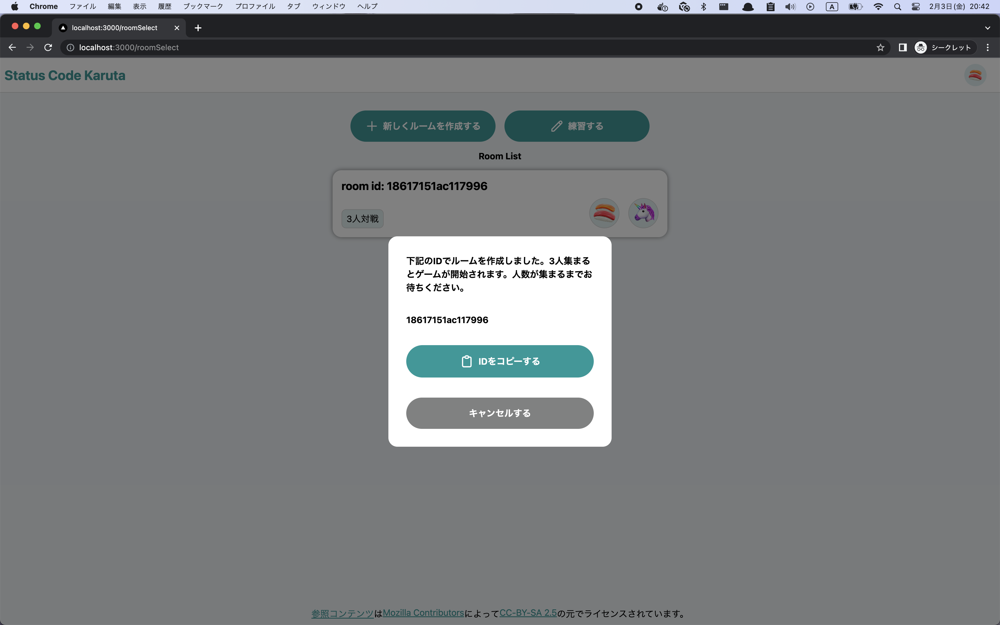

## Getting Started

```bash
npm install
npm run dev
# or
yarn
yarn dev
```

## how to play

1.  Open [http://localhost:3000](http://localhost:3000)

    

1.  Choose an icon with a nickname.

    

1.  Choose to practice or play a game.(When playing games, you must share the IP address of your machine with the users you play with.)

    

1.  Reveal what you know about status codes.

    

    <hr />




## Technology used

- [Next.js](https://nextjs.org/)
- [TypeScript](https://www.typescriptlang.org/)
